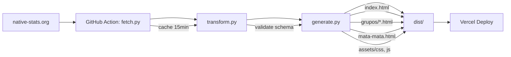

# SPEC: Copa 2026 Static Site

## 1. Overview
- **One-liner:** Site estático que mostra a tabela completa da Copa do Mundo 2026 (fase de grupos + mata-mata) com dados atualizados a cada 15 min do native-stats.org.
- **Problem:** Não existe site brasileiro leve, responsivo e auto-atualizável com visual de "tabela de campeonato" (bracket + grupos) para a Copa 2026.
- **Success criteria:**
  - Deploy automático a cada 15 min via GitHub Actions
  - Página carrega em <2s (Lighthouse Performance ≥90)
  - Visual idêntico à referência Excel Easy (bracket + tabelas de grupos)
  - Zero passos manuais após setup inicial

## 2. Architecture

- **Stack:** Python 3.12 (fetch/transform/generate), Jinja2 templates, vanilla CSS/JS, GitHub Actions, Vercel
- **Components:**
  - `fetch.py` — baixa HTML do native-stats, salva raw HTML (cache/debug)
  - `transform.py` — parseia HTML → normaliza para JSON schema interno (teams, matches, standings, bracket)
  - `generate.py` — usa Jinja2 + dados JSON → gera `dist/` com HTMLs estáticos
  - GitHub Action — roda a cada 15 min, commit + push se houver mudanças → Vercel auto-deploy
- **Data flow:** raw HTML → validated JSON → rendered HTML

## 3. Data Model
| Entity | Fields | Source | Update frequency |
|--------|--------|--------|------------------|
| Team | id, name, flag_emoji, flag_url, group, fifa_code | native-stats standings | 15 min |
| Match | id, date_utc, team_a_id, team_b_id, score_a, score_b, stage, group, status (scheduled/live/final) | native-stats matches | 15 min |
| Standing | team_id, pos, mp, w, d, l, gf, ga, gd, pts, form | native-stats standings | 15 min |
| BracketPairing | round (32,16,8,4,2,final,3rd), match_num, team_a_id, team_b_id, next_winner_slot | FIFA rules (derived) | computed |
| Scorer | player, team_id, goals, assists, shots | native-stats scorers | 15 min |

**Knockout bracket logic:** FIFA 2026 format — 12 groups, top 2 + 8 best 3rd place → 32 teams. Pairings per FIFA bracket (1A vs 2B, 1C vs 2D, etc.). We compute bracket from final standings.

## 4. UI / UX
- **Pages:**
  - `index.html` — landing: banner + quick links + "Última atualização: X min atrás"
  - `grupos.html` — visão geral dos 12 grupos (cards colapsáveis)
  - `grupos/{A-L}.html` — tabela detalhada do grupo (standings + jogos)
  - `mata-mata.html` — bracket completo (32 → final + 3º lugar)
  - `artilheiros.html` — top 20 goleadores
  - `jogos.html` — lista cronológica de todos os jogos (filtro por fase)
- **Responsive breakpoints:** mobile ≤640px, tablet ≤1024px, desktop >1024px
- **Visual reference:** Excel Easy bracket style — clean lines, team flags, scores, progression arrows
- **Components:**
  - `GroupTable` — standings + match results
  - `BracketTree` — SVG/Canvas bracket with connectors
  - `MatchCard` — team flags, score, time, stage badge
  - `Loader` — skeleton enquanto carrega JSON
  - `ErrorBanner` — "Falha ao atualizar dados. Última atualização bem-sucedida: X"
- **Accessibility:** semantic HTML (`<table>`, `<thead>`, `<tbody>`), ARIA labels on bracket, contrast AA, focus states

## 5. Deployment & Automation
- **Hosting:** Vercel (project `copa2026-static`, linked to GitHub repo)
- **CI/CD:** GitHub Actions workflow `.github/workflows/update.yml`
  - Schedule: `*/15 * * * *` (every 15 min)
  - Steps: checkout → setup python → run `fetch.py && transform.py && generate.py` → if `dist/` changed → commit + push → Vercel auto-deploys
- **Secrets:** None needed (public source). `VERCEL_TOKEN`, `VERCEL_ORG_ID`, `VERCEL_PROJECT_ID` in GitHub Secrets for manual deploy if needed.
- **Rollback:** `git revert` on commit que quebrou → auto-redeploy. Vercel instant rollback via dashboard.

## 6. Risk Analysis & Mitigations
| Risk | Likelihood | Impact | Mitigation |
|------|------------|--------|------------|
| Source HTML structure changes | High | High | CSS selectors com fallback; schema validation (pydantic); alerta no log se parse falhar; salva raw HTML para debug |
| Rate limit / IP block | Medium | High | GitHub Actions roda em IPs rotativos; cache local de 1 min; `robots.txt` respeitado; user-agent identificado |
| Timezone confusion (UTC vs Brasil) | Medium | Medium | Armazenar tudo em UTC; exibir com `Intl.DateTimeFormat(pt-BR, {timeZone: 'America/Sao_Paulo'})` no JS |
| Dados incompletos (jogos não iniciados) | High | Low | Status `scheduled` → mostra "vs" + horário; `live` → mostra placar parcial; `final` → placar final |
| CORS bloqueia fetch no browser | High | High | **Zero fetch no browser** — dados embutidos no build (`data.json` ou inline no HTML) |
| Deploy falha silenciosamente | Low | High | Health check: `dist/health.json` com timestamp; GitHub Action falha se `generate.py` retornar non-zero; Vercel webhook alerta |
| Bracket pairings incorretos | Medium | High | Testes unitários com standings conhecidos; validação visual manual na primeira versão |
| 48 times → 12 grupos → 32 mata-mata logic complexa | Medium | High | Isolar em `bracket.py` com testes; documentar regra FIFA oficial |

## 7. Task Breakdown (ordered, with verification)
| # | Task | Command / Test | Done when |
|---|------|----------------|-----------|
| 1 | Setup repo + structure | `mkdir -p copa2026-static/{src,templates,dist,.github/workflows}` | Pastas criadas |
| 2 | `fetch.py` — baixa e salva raw HTML | `python src/fetch.py && ls raw/wc_*.html` | HTML salvo, >50KB |
| 3 | `transform.py` — parse + normalize + valida | `python src/transform.py && python -m json.tool data/teams.json \| head -30` | JSON válido com 48 times, 100+ jogos |
| 4 | `bracket.py` — calcula pairings do mata-mata | `python src/bracket.py && python -m json.tool data/bracket.json` | 31 pairings (32→16→8→4→2→1 + 3º) |
| 5 | Templates Jinja2 (index, grupos, mata-mata, artilheiros, jogos) | `ls templates/*.html` | 6 templates |
| 6 | `generate.py` — renderiza templates → `dist/` | `python src/generate.py && ls dist/` | `dist/index.html`, `dist/grupos/`, `dist/mata-mata.html`, `dist/data.json` |
| 7 | CSS/JS assets (responsive, bracket SVG, loader) | `ls dist/assets/` | `style.css`, `bracket.js`, `app.js` |
| 8 | Validação visual local | `python -m http.server -d dist 8080` + browser | Match reference image |
| 9 | GitHub Action workflow | `.github/workflows/update.yml` + push | Action roda, commit se mudou, Vercel deploya |
| 10 | Vercel project link + domain | `vercel link` + `vercel --prod` | URL pública retorna 200 |
| 11 | Lighthouse CI | `npx lighthouse-ci --config=lighthouse.json` | Perf ≥90, A11y ≥95, SEO ≥90 |
| 12 | Monitoramento: log de execução + alerta falha | Ver logs GH Actions por 24h | 96 runs (15min×24h) sem falha |

## 8. Verification Checklist (pre-deploy)
- [ ] `htmlhint dist/**/*.html` passes
- [ ] `stylelint dist/assets/style.css` passes
- [ ] Lighthouse: Performance ≥90, Accessibility ≥95, SEO ≥90
- [ ] Mobile viewport test (Chrome DevTools device toolbar)
- [ ] Data freshness: "Última atualização: X min atrás" visível no index
- [ ] Error state: mostra banner amigável quando fetch falha (simular desligando net)
- [ ] Bracket rendering: 31 jogos aparecem, linhas conectam corretamente
- [ ] Group tables: 12 grupos, 4 times cada, ordenados por pts→GD→GF
- [ ] Timezone: horários mostram em horário de Brasília (UTC-3)
- [ ] Flags: emoji ou SVG carregam sem erro 404

---

## Decision Log
- 2026-06-27: Optou por GitHub Actions (cron 15min) em vez de Vercel Cron (free tier = 1/dia)
- 2026-06-27: Dados embutidos no build (`dist/data.json`) — zero fetch client-side
- 2026-06-27: Bracket computado no build a partir das standings finais (FIFA rules)
- 2026-06-27: Flags via emoji Unicode (zero assets, leve) — fallback para SVG se necessário